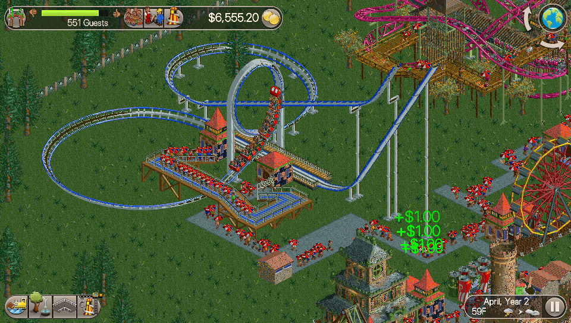

# RCT Classic Vita

<p align="center"></p>

This is a wrapper/port of <b>RollerCoaster Tycoon Classic</b> for the *PS Vita*.

The port works by loading the official Android ARMv7 executables in memory, resolving their imports with native functions and patching them in order to properly run.
By doing so, it's basically as if we emulate a minimalist Android environment in which we run natively the executable as they are.

## Changelog

### v.1.0

- Initial Release.

## Notes and Tips

- The game has been tested with v.1.2.1 of the game.
- Very rarely, game may crash at boot. If it happens, just restart the app.
- The game can tank heavily framerate depending on how much is going on. Disabling music rides should help mitigate framerate issues.
- The game ships in two versions: a speedhack one (default) and a safe one (launchable by clicking on the related option in the Livearea.) The speedhack version will have a way better framerate in exchange of some occasional glitching and flickering.
- In-app purchase DLCs can be unlocked. Check the <b>DLCs Support</b> to know how.

## Setup Instructions (For End Users)

- Install [kubridge](https://github.com/TheOfficialFloW/kubridge/releases/) and [FdFix](https://github.com/TheOfficialFloW/FdFix/releases/) by copying `kubridge.skprx` and `fd_fix.skprx` to your taiHEN plugins folder (usually `ux0:tai`) and adding two entries to your `config.txt` under `*KERNEL`:
  
```
  *KERNEL
  ux0:tai/kubridge.skprx
  ux0:tai/fd_fix.skprx
```

**Note** Don't install fd_fix.skprx if you're using rePatch plugin

- **Optional**: Install [PSVshell](https://github.com/Electry/PSVshell/releases) to overclock your device to 500Mhz.
- Install `libshacccg.suprx`, if you don't have it already, by following [this guide](https://samilops2.gitbook.io/vita-troubleshooting-guide/shader-compiler/extract-libshacccg.suprx).
- Extract `libfmodstudio.suprx`, if you don't have it already, by following [this guide](https://gist.github.com/hatoving/99253e1b3efdefeaf0ca66e0c5dc7089).
- Install the vpk from Release tab.
- Obtain your copy of *RollerCoaster Tycoon Classic* legally for Android in form of an `.apk` and two `.obb` files.
- Open the apk with your zip explorer and extract all the `.obb` files inside the `assets` folder to `ux0:data/rct/assets`. You can then remove those files from inside the apk to save space.
- Place the `.apk` file, renamed as `game.apk`, inside `ux0:data/rct`.
- Place the two `.obb` files, renamed respectively as `main.obb` and `patch.obb` omsode `ux0:data/rct`.

## DLCs Support

DLCs for RollerCoaster Tycoon Classic can be enabled by editing a config file named settings.cfg located inside ux0:app/RCTCLASS1. We strongly encourage to enable support for these contents solely if you possess these contents on your Android device. Sadly, we have no way to propose a license check on Vita against your purchased in-game contents on Android, so show respect and support the original authors of the game first before proceeding. Open the file ux0:app/RCTCLASS1/settings.cfg and change enable_dlcs=0 to enable_dlcs=1.

## Build Instructions (For Developers)

In order to build the loader, you'll need a [vitasdk](https://github.com/vitasdk) build fully compiled with softfp usage.  
You can find a precompiled version here: https://github.com/vitasdk/buildscripts/actions/runs/1102643776.  
Additionally, you'll need these libraries to be compiled as well with `-mfloat-abi=softfp` added to their CFLAGS:

- [libmathneon](https://github.com/Rinnegatamante/math-neon)

  - ```bash
    make install
    ```

- [vitaShaRK](https://github.com/Rinnegatamante/vitaShaRK)

  - ```bash
    make install
    ```

- [kubridge](https://github.com/TheOfficialFloW/kubridge)

  - ```bash
    mkdir build && cd build
    cmake .. && make install
    ```

- [vitaGL](https://github.com/Rinnegatamante/vitaGL)

  - ````bash
    make SOFTFP_ABI=1 install
    ````

After all these requirements are met, you can compile the loader with the following commands:

```bash
mkdir build && cd build
cmake .. && make
```

## Credits

- TheFloW for the original .so loader.
- CatoTheYounger for the screenshots and for testing the homebrew.
- gl33ntwine for the Livearea assets.
